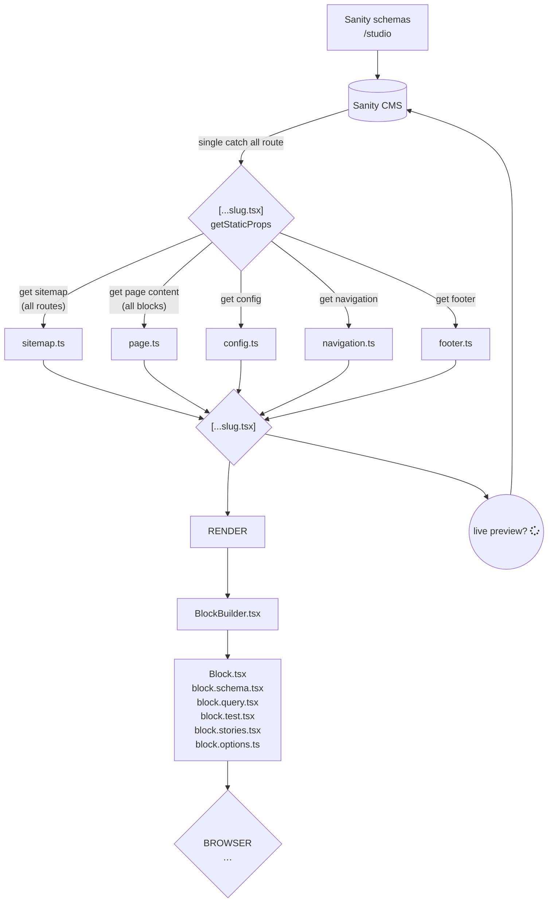

# Agency Starter Framework!

An Agency Starter framework using Sanity & NextJS.

A page builder with a no code experience
The flexibility to change site structure
40 unique blocks pre-configured to look awesome responsively

[](https://vercel.com/new/clone?repository-url=https%3A%2F%2Fgithub.com%2FMawla%2FAgency-Starter-Framework&env=SANITY_API_WRITE_TOKEN,SANITY_API_READ_TOKEN,SANITY_WEBHOOK_SECRET,SANITY_PREVIEW_SECRET,SANITY_STUDIO_PROJECT_PATH,SANITY_STUDIO_API_DATASET,NEXT_PUBLIC_SANITY_DATASET,SANITY_STUDIO_API_PROJECT_ID,NEXT_PUBLIC_SANITY_PROJECT_ID&envDescription=Sanity%20%26%20Vercel%20tokens&envLink=https%3A%2F%2Fgithub.com%2FMawla%2FAgency-Starter-Framework%2Fblob%2Fmain%2Fdocs%2FGetting%2520Started.md)

To try out with images download this [zip](https://drive.google.com/file/d/13wd3yYpikq0lDSsGq5IyGa0zv24ruPRM/view?usp=sharing) and use import like below.

To try out the demo site without images:
```sanity dataset import production-1720544495.tar.gz production```


Example Website:
https://sgw-template-saas-1.vercel.app/


# Features:
## In CMS theming
https://github.com/Mawla/Agency-Starter-Framework/assets/1926968/6ef5fa6d-1e8c-4258-8124-92f4024d4563

## Block Building System

* Empowering page building for common page types and comprehensive content variety
* e.g. content pages, landing pages, blogs, case studies, pricing, press releases etc
* 20 Common blocks (hero, feature list, pricing plan, card grid, article, faq, logo cloud, video etc)
* Ready-made presets, or create your own

https://github.com/Mawla/Agency-Starter-Framework/assets/1926968/26bde983-d3d5-40ea-8e27-be0811e4422d

## Versatile Page Building

* Global accessibility with Multi-language Support
* Seamless page linking, guaranteed 0 broken internal links
* Reusable document collections like pricing plans, people, faq's and testimonials
* Advanced tagging and Algolia search
* Fast live previews
* Flexible theming from CMS

https://github.com/Mawla/Agency-Starter-Framework/assets/1926968/7095e1f6-4147-44d2-88dd-e9c80bb959d4

## Scalability
* Unlimited pages
* Fine grained SEO control, opengraph images, sitemaps, redirects, GTM integration
* Effortless Deployment
* Mobile first design, fully responsive
* Fast load times, optimised images
* Copy blocks between pages
* Youtube, Vimeo and script embeds

https://github.com/Mawla/Agency-Starter-Framework/assets/1926968/2365dd3f-f0f5-417f-ac0f-71455d3bae29


```
> yarn dev # next.js localhost:3000
> yarn cms # sanity localhost:3333
> yarn storybook
```

Get started

- `yarn dev` runs next.js
- `yarn cms` runs sanity
- `yarn storybook` runs storybook
- `yarn test` runs tests

- `yarn create-page` runs the cli to add a page
- `yarn create-block` runs the cli to create a block

See /docs for some more information.

## App flow



...
