# Engine

```
> yarn dev # next.js localhost:3000
> yarn cms # sanity localhost:3333
> yarn storybook
```

Some useful links

- https://github.com/xxx/xxx.com
- https://xxx.vercel.app (prod)
- https://xxx.vercel.app/cms (prod)
- https://development-xxx.vercel.app (dev)
- https://development-xxx.vercel.app/cms (dev)

Get started

- `yarn dev` runs next.js
- `yarn cms` runs sanity
- `yarn storybook` runs storybook
- `yarn test` runs tests

- `yarn create-page` runs the cli to add a page
- `yarn create-hero` runs the cli to create a hero
- `yarn create-module` runs the cli to create a module
- `yarn create-dialog` runs the cli to create a dialog

See /docs for some more information.

## App flow

```mermaid
graph TD
    SCHEMAS["Sanity schemas<br>/studio"]-->CMS
    CMS[(Sanity CMS)]-->|single catch all route|DATA{"[...slug.tsx] <br>getStaticProps"}
    PREVIEW_MODE((live preview? fa:fa-spinner))--->CMS

    DATA -->|"get sitemap<br>(all routes)"| QUERY_SITEMAP[sitemap.ts]-->CATCH_ALL_RENDER
    DATA -->|"get page content<br>(all modules)"| QUERY_PAGE[page.ts]-->CATCH_ALL_RENDER
    DATA -->|get config| QUERY_CONFIG[config.ts]-->CATCH_ALL_RENDER
    DATA -->|get navigation| QUERY_NAV[navigation.ts] -->CATCH_ALL_RENDER
    DATA -->|get footer| QUERY_FOOTER[footer.ts] -->CATCH_ALL_RENDER

    CATCH_ALL_RENDER{"[...slug.tsx]"} -->RENDER
    CATCH_ALL_RENDER-->PREVIEW_MODE

    RENDER{renderers} -->RENDER_HEROES
    RENDER -->RENDER_MODULES
    RENDER -->RENDER_DIALOGS

    RENDER_MODULES[ModuleBuilder.tsx]-->MODULE
    RENDER_DIALOGS[DialogBuilder.tsx]-->PAGE

    HERO[Hero.tsx<br>hero.schema.tsx<br>hero.query.tsx<br>hero.test.tsx<br>hero.stories.tsx<br>hero.options.ts]-->PAGE
    MODULE[Module.tsx<br>module.schema.tsx<br>module.query.tsx<br>module.test.tsx<br>module.stories.tsx<br>module.options.ts]-->PAGE

    PAGE{"<br>BROWSER<br>…"}
```


